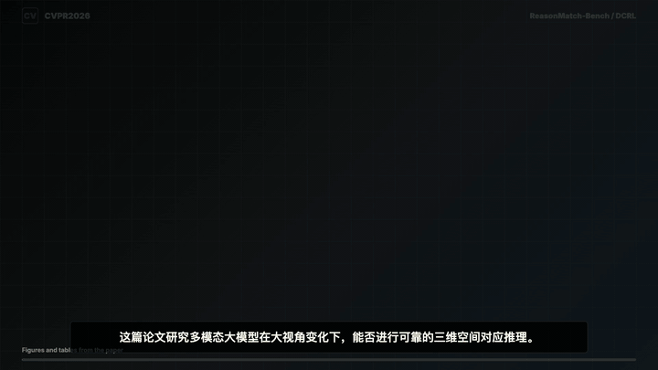

# Paper Explainer Video Skill

`paper-explainer-video` is a Codex skill for turning a research paper PDF or paper URL into a 60-90 second YouTube-style explainer video.

It supports Chinese or English narration, extracts real figures and tables from the paper, generates voiceover with `edge-tts`, builds a 16:9 HyperFrames composition, renders an MP4, and performs frame/audio QA.

## Sample



Sample video: [`docs/assets/sample-paper-explainer-video.mp4`](docs/assets/sample-paper-explainer-video.mp4)

## What It Does

- Reads a paper PDF or URL and extracts the title, problem, contributions, method, experiments, results, and limitations.
- Extracts real paper figures, tables, or page crops as visual evidence.
- Writes a concise narration script and sentence-level subtitles.
- Generates Chinese or English voiceover with `edge-tts`.
- Builds and renders a 16:9 HyperFrames MP4.
- Checks rendered frames, subtitles, visual assets, and audio/video duration.
- Records commands, file structure, failures, and fixes in a run log.

## Install

Copy the skill folder into your Codex skills directory:

```bash
mkdir -p ~/.codex/skills
cp -R skills/paper-explainer-video ~/.codex/skills/
```

Then start a new Codex session so the skill metadata is loaded.

## Use

Ask Codex with a paper PDF path or URL:

```text
Use the paper-explainer-video skill to make a 60-90 second English paper explainer video from /path/to/paper.pdf.
```

Chinese example:

```text
请使用 paper-explainer-video skill，基于 /path/to/paper.pdf 制作一个 60-90 秒中文论文解读视频。
```

## Requirements

- Node.js and HyperFrames CLI via `npx hyperframes`
- FFmpeg / ffprobe
- Python 3
- `edge-tts`
- PDF extraction tooling, preferably PyMuPDF when poppler is unavailable:

```bash
python3 -m pip install --user edge-tts pymupdf
```

## Environment Setup

Restart Codex after installing or updating skills so the skill index is refreshed.

### macOS

Install system tools:

```bash
brew install node ffmpeg git-lfs
git lfs install
```

Install Python packages:

```bash
python3 -m pip install --user --upgrade pip
python3 -m pip install --user edge-tts pymupdf
```

Validate the core tools:

```bash
node -v
ffmpeg -version
ffprobe -version
npx --yes hyperframes --help
python3 -c "import edge_tts, fitz; print('edge-tts + pymupdf ok')"
```

### Ubuntu / Debian

Install base tools:

```bash
sudo apt update
sudo apt install -y curl git git-lfs ffmpeg python3 python3-venv python3-pip
git lfs install
```

Install Node.js 22:

```bash
curl -fsSL https://deb.nodesource.com/setup_22.x | sudo -E bash -
sudo apt install -y nodejs
```

Install Chrome for HyperFrames rendering:

```bash
wget -q https://dl.google.com/linux/direct/google-chrome-stable_current_amd64.deb
sudo apt install -y ./google-chrome-stable_current_amd64.deb
rm google-chrome-stable_current_amd64.deb
```

If Google Chrome is unavailable, Chromium can work:

```bash
sudo apt install -y chromium-browser || sudo apt install -y chromium
```

Install Python packages:

```bash
python3 -m pip install --user --upgrade pip
python3 -m pip install --user edge-tts pymupdf
```

### Fedora / RHEL

Install base tools:

```bash
sudo dnf install -y curl git git-lfs ffmpeg python3 python3-pip
git lfs install
```

Install Node.js 22:

```bash
curl -fsSL https://rpm.nodesource.com/setup_22.x | sudo bash -
sudo dnf install -y nodejs
```

Install Chrome:

```bash
sudo dnf install -y fedora-workstation-repositories
sudo dnf config-manager --set-enabled google-chrome
sudo dnf install -y google-chrome-stable
```

Install Python packages:

```bash
python3 -m pip install --user --upgrade pip
python3 -m pip install --user edge-tts pymupdf
```

### Headless Linux Notes

On a headless server, start with:

```bash
npx --yes hyperframes doctor
```

If Chrome launch fails, install common browser runtime libraries:

```bash
sudo apt install -y \
  libnss3 libatk-bridge2.0-0 libgtk-3-0 libxss1 libasound2 \
  libx11-xcb1 libxcomposite1 libxdamage1 libxrandr2 libgbm1
```

### Install The Skill

Clone this repo and copy the skill into your Codex skills directory:

```bash
git clone https://github.com/Z-MU-Z/paper-explainer-video-skill.git
cd paper-explainer-video-skill
mkdir -p ~/.codex/skills
cp -R skills/paper-explainer-video ~/.codex/skills/
```

Then restart Codex.

### Verification Checklist

Run these commands on a configured machine:

```bash
node -v
npm -v
python3 --version
ffmpeg -version
ffprobe -version
google-chrome --version || chromium --version || true
npx --yes hyperframes --help
npx --yes hyperframes doctor
python3 -c "import edge_tts, fitz; print('edge-tts + pymupdf ok')"
```

## Repository Layout

```text
.
├── README.md
├── LICENSE
├── skills/
│   └── paper-explainer-video/
│       └── SKILL.md
└── docs/
    └── assets/
        ├── sample-paper-explainer-video.gif
        ├── sample-paper-explainer-video.png
        └── sample-paper-explainer-video.mp4
```

## Notes

This repository is intentionally focused on one skill. Generated project folders, intermediate PDF crops, narration audio, and render outputs should live in your working project directory rather than in this repo.

## Acknowledgements

This skill was built with reference to the broader HyperFrames-based video workflow in
[topo-ai/ai-video-skills](https://github.com/topo-ai/ai-video-skills). Thanks to that project for the environment setup notes and reusable AI video production patterns.
