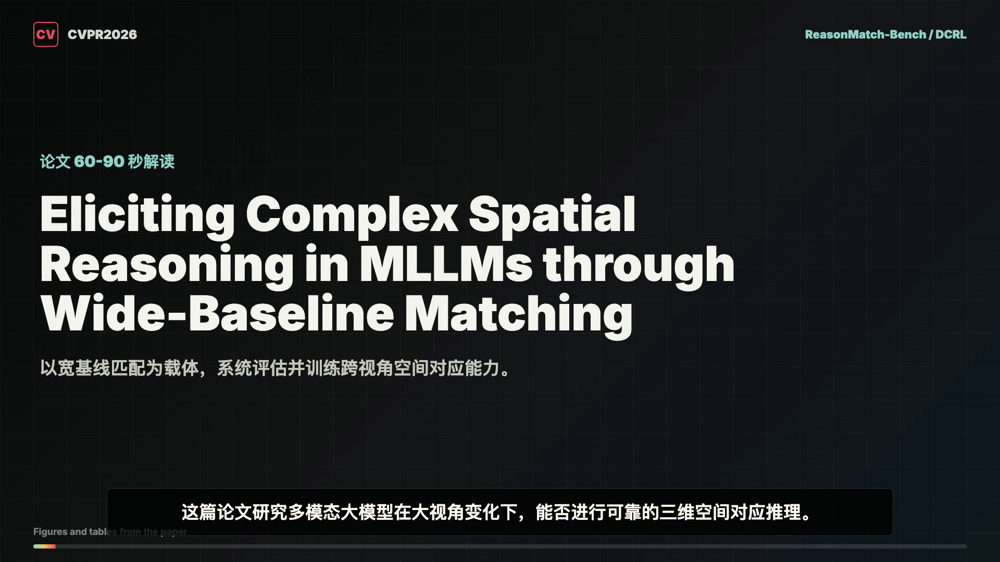

# Paper Explainer Video Skill

`paper-explainer-video` is a Codex skill for turning a research paper PDF or paper URL into a 60-90 second YouTube-style explainer video.

It supports Chinese or English narration, extracts real figures and tables from the paper, generates voiceover with `edge-tts`, builds a 16:9 HyperFrames composition, renders an MP4, and performs frame/audio QA.

## Sample



Sample video: [`docs/assets/sample-paper-explainer-video.mp4`](docs/assets/sample-paper-explainer-video.mp4)

## What It Does

- Reads a paper PDF or URL and extracts the title, problem, contributions, method, experiments, results, and limitations.
- Extracts real paper figures, tables, or page crops as visual evidence.
- Writes a concise narration script and sentence-level subtitles.
- Generates Chinese or English voiceover with `edge-tts`.
- Builds and renders a 16:9 HyperFrames MP4.
- Checks rendered frames, subtitles, visual assets, and audio/video duration.
- Records commands, file structure, failures, and fixes in a run log.

## Install

Copy the skill folder into your Codex skills directory:

```bash
mkdir -p ~/.codex/skills
cp -R skills/paper-explainer-video ~/.codex/skills/
```

Then start a new Codex session so the skill metadata is loaded.

## Use

Ask Codex with a paper PDF path or URL:

```text
Use the paper-explainer-video skill to make a 60-90 second English paper explainer video from /path/to/paper.pdf.
```

Chinese example:

```text
请使用 paper-explainer-video skill，基于 /path/to/paper.pdf 制作一个 60-90 秒中文论文解读视频。
```

## Requirements

- Node.js and HyperFrames CLI via `npx hyperframes`
- FFmpeg / ffprobe
- Python 3
- `edge-tts`
- PDF extraction tooling, preferably PyMuPDF when poppler is unavailable:

```bash
python3 -m pip install --user edge-tts pymupdf
```

## Repository Layout

```text
.
├── README.md
├── LICENSE
├── skills/
│   └── paper-explainer-video/
│       └── SKILL.md
└── docs/
    └── assets/
        ├── sample-paper-explainer-video.png
        └── sample-paper-explainer-video.mp4
```

## Notes

This repository is intentionally focused on one skill. Generated project folders, intermediate PDF crops, narration audio, and render outputs should live in your working project directory rather than in this repo.
